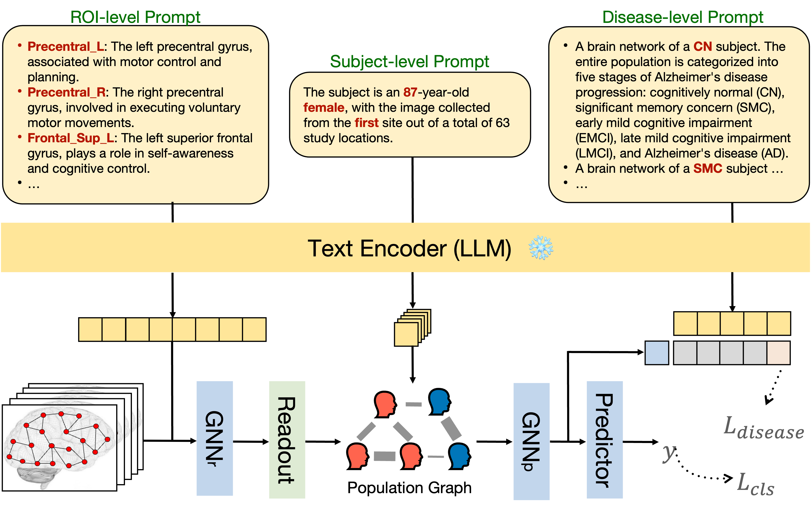

# BrainPrompt

This is the official PyTorch implementation of BrainPrompt from the paper 
*"	
BrainOOD: Out-of-distribution Generalizable Brain Network Analysis"* early accepted by 28th International Conference on Medical Image Computing and Computer-Assisted Intervention (MICCAI'25).

## Data
All Preprocessed data used in this paper are published in [this paper](https://proceedings.neurips.cc/paper_files/paper/2023/file/44e3a3115ca26e5127851acd0cedd0d9-Paper-Datasets_and_Benchmarks.pdf). 
Data splits and configurations are stored in `./data/` and `./configs/`. If you want to process your own data, please check the dataloader script `./data/BrainNet.py`.

## Usage

Please check `baseline.sh` on how to run the project.

## Contact

If you have any questions, please feel free to reach out at `jiaxing003@e.ntu.edu.sg`.
